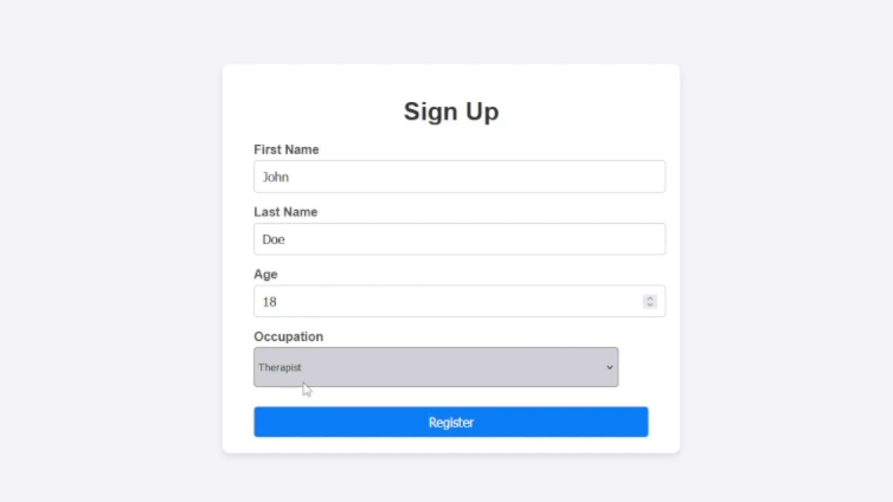

# Truthful Job Picker

Truthful Job Picker is a novel approach to verifying user information. The user now has to answer a question related to their specified occupation. This ensures the accuracy of provided information.


## Setup and Installation

### Prerequisites

- Python 3.x
- Flask
- Ollama
- Llama3

### Installation


1. Clone the repository:
    ```sh
    git clone https://github.com/sercan985/truthful-job-picker.git
    cd truthful-job-picker
    ```

2. Install the required dependencies:
    ```sh
    pip install flask ollama
    ```
    [Ollama installation guide for windows](https://github.com/ollama/ollama/blob/main/docs/windows.md)
[Ollama installation guide for linux](https://github.com/ollama/ollama/blob/main/docs/linux.md)

3. Start ollama
    ```sh
    ollama run llama3
    ```
    
4. Run the Flask application:
    ```sh
    python app.py
    ```

5. Open your web browser and navigate to `http://localhost:5000`.


## Contributing

If you want to contribute to this project, please fork the repository and create a pull request with your changes.

## License

This project is licensed under the MIT License. See the [LICENSE](LICENSE) file for details.
